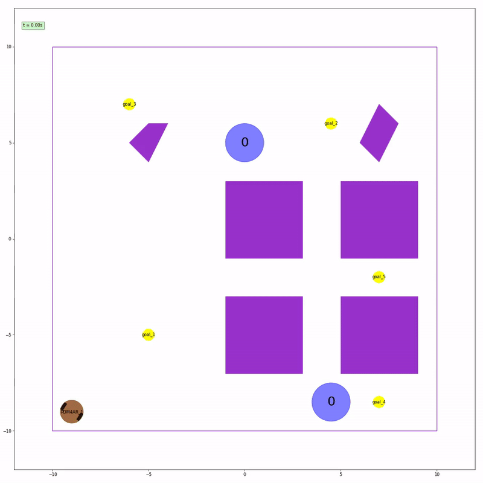
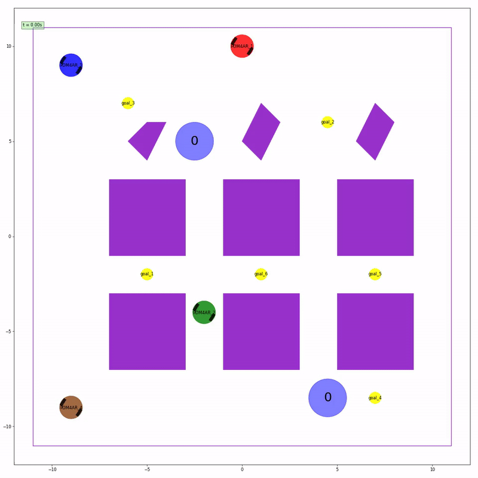
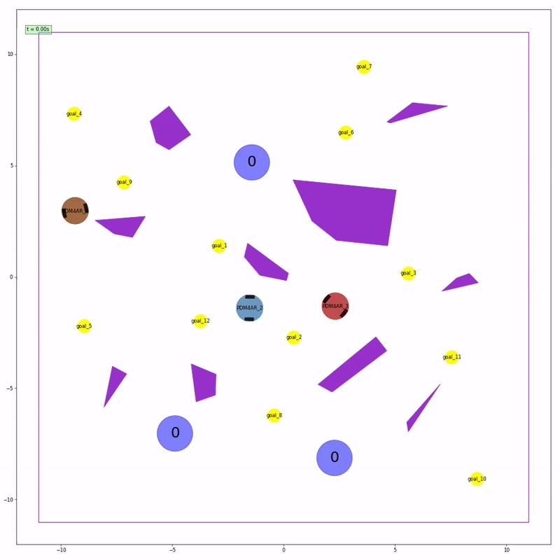

# Warehouse Multi-Agent Goal Collection

**Global coordination once. Local intelligence thereafter.**

How do you make a fleet of robots work efficiently together when they cannot communicate during execution, only observe a small and partially occluded portion of the world, and become permanently disabled after a single collision?

This project implements a decentralized multi-robot autonomy stack for cooperative pickup-and-delivery in warehouse environments. A one-shot global planner assigns work before execution begins; after that, each robot operates independently using only local perception, reactive conflict handling, and differential-drive control.

---

## At a glance

- Multi-robot pickup and delivery under partial observability
- One-shot global task allocation with no runtime communication
- Decentralized execution with local adaptation
- Reactive handling of dynamic obstacles and disappearing goals
- Corridor management, yielding, and local detour generation
- Real-time control for differential-drive robots

---

## Why this problem is hard

This is not just a path-planning problem.

Each robot must:
- collect shared goals
- transport them to collection points
- avoid static obstacles
- avoid other robots acting as dynamic obstacles
- operate under line-of-sight sensing only
- recover when another robot takes its intended goal first
- do all of this without communicating after initialization

The challenge is not only motion generation. It is **fleet-level coordination under uncertainty**, where poor local decisions can significantly degrade global performance.

---

## Core idea

The system is built around a simple but effective split:

### 1. Global coordination before execution

A centralized planner uses full initial knowledge of the environment to compute:
- task allocation
- pickup and delivery ordering
- waypoint-level routing
- collection-point assignment
- coordination metadata serialized into a shared plan

### 2. Local intelligence during execution

Once the simulation starts, each robot runs independently and:
- follows its assigned task sequence
- tracks a continuous path
- reacts to visible robots and goal changes
- yields, detours, or backs off in local conflicts
- updates its behavior using only local observations

**Shared plan. Local decisions. No runtime communication.**

---

## Demo

### Emergent multi-agent behavior

<p align="center">
  
  
</p>

<p align="center">
  
  
</p>

### What these episodes show

- **Config 1**: baseline cooperative pickup and delivery
- **Config 2**: denser obstacle-aware routing
- **Config 3**: stronger robot-robot interaction and local conflict handling
- **Config 4**: heavier congestion with decentralized adaptation

These scenarios illustrate how coordinated fleet behavior can emerge without runtime communication, relying only on shared initialization and local perception.

---

## System architecture

### Global planner

The global planner computes the high-level structure of execution:
- which robot should collect which goals
- in what order
- through which collection points
- along which waypoint paths

This is the phase where the system exploits full world knowledge.

### Runtime controller

Each robot then runs the same decentralized policy:
- read local observations
- track the current task and phase
- follow a path continuously
- detect local conflicts
- apply yield, detour, or backoff logic
- output wheel commands

This gives the fleet a coherent global strategy while preserving runtime autonomy.

---

## What is actually implemented

The runtime policy is not a simple “go-to-target” controller.

It includes:
- task-state management
- path-progress tracking
- lookahead-based continuous target generation
- local detour insertion around dynamic blockers
- priority logic near collection points
- narrow-corridor backoff and release behavior
- reassignment when goals disappear from local observations

In practice, this means each robot can:
- continue executing when the world changes locally
- avoid deadlocks in tight spaces
- preserve throughput without relying on communication

---

## Motion model

The robots are modeled as differential-drive systems.

### State

```text
x = [x, y, psi]
```

where:
- `x, y` are planar coordinates
- `psi` is the heading angle

### Control

```text
u = [omega_l, omega_r]
```

where:
- `omega_l` is the left wheel angular velocity
- `omega_r` is the right wheel angular velocity

The simulator clips commands to wheel-speed limits, but overly aggressive commands are still penalized through the actuation-effort metric.

---

## Path tracking

The controller uses continuous path tracking rather than naive waypoint hopping.

It maintains:
- the current path polyline
- progress along that path
- a forward lookahead target

This produces smoother behavior and reduces:
- oscillation
- stop-and-go motion
- unnecessary travel distance

---

## Dynamic obstacle handling

Other robots are treated as first-class dynamic obstacles.

When another robot blocks the near-horizon path, the controller can:
- detect blockage along the active path
- compute a local geometric detour
- splice that detour into the current route
- rejoin the original path once clearance is restored

This is one of the main reasons the system remains usable in dense multi-robot interactions.

---

## Conflict resolution

### Around collection points

The agent applies explicit priority rules based on:
- carrying state
- relative distance
- convergence behavior
- tie-breaking logic

### In narrow corridors

The agent can:
- detect corridor entry conditions
- back off to a hold point
- wait for the other robot to clear
- release the corridor safely
- avoid oscillatory re-entry

This is where the implementation moves beyond a toy controller and behaves more like an engineered multi-robot system.

---

## Observability model

Robots do not have access to the full runtime state.

Each agent only sees:
- nearby robots within sensing range and line of sight
- nearby goals that are still available
- static obstacles known from initialization

That makes the runtime problem fundamentally **partially observable**, which is why the architecture combines:
- strong global initialization
- lightweight local adaptation

---

## Problem constraints

The system is designed around the official exercise rules:

- each robot can carry **at most one goal**
- goals are collected automatically on contact
- goals are delivered automatically inside collection zones
- no communication is allowed after global planning
- collisions permanently disable robots
- execution must remain real-time compatible

These constraints make safety and local conflict handling central to the design.

---

## Performance priorities

The score function strongly rewards:
- delivered goals
- zero collisions
- early completion
- short travel distance
- low actuation effort
- low computation time

So the real design objective is:

**maximize throughput without paying for collisions, delay, or wasted motion.**

---

## Score structure

```text
score = goals * 100
       - collisions * 500
       + time_bonus
       - distance_penalty
       - effort_penalty
       - compute_penalty
```

This means:
- throughput matters
- safety matters even more
- efficiency is not cosmetic, it directly affects the score

---

## Repository structure

```text
multi-agent-goal-collection/
├── README.md
├── requirements.txt
├── assets/
│   ├── images/
│   └── video/
├── examples/
│   ├── agent_process.py
│   ├── config_1.yaml
│   ├── config_2.yaml
│   ├── config_3.yaml
│   ├── ex14.py
│   ├── perf_metrics.py
│   ├── random_config.py
│   ├── random_ex14_config.yaml
│   ├── restricted_loads.py
│   ├── run_example.py
│   └── utils_config.py
├── src/
│   ├── __init__.py
│   └── multi_agent_goal_collection/
│       ├── agent.py
│       └── __init__.py
└── video/
    ├── config1.gif
    ├── config1.mp4
    ├── config2.gif
    ├── config2.mp4
    ├── config3.gif
    ├── config3.mp4
    ├── config4.gif
    ├── config4.mp4
    └── palette.png
```

---

## Key components

| Component | Role |
|----------|------|
| `Pdm4arGlobalPlanner` | One-shot global coordination and task allocation |
| `GlobalPlanMessage` | Serialized plan broadcast to all robots |
| `Pdm4arAgent` | Decentralized runtime policy |
| `GoalTask` | Pickup-and-delivery task structure |
| `AgentPlan` | Ordered task list assigned to a robot |
| `get_commands()` | Real-time control loop |

---

## Execution flow

### Before the episode

- ingest the environment, robots, goals, and collection points
- compute the global assignment and routing structure
- serialize the shared global plan
- broadcast it once to all agents

### During the episode

- each robot deserializes its own task list
- follows the assigned pickup-and-delivery sequence
- reacts to local obstacles and robot interactions
- adapts when its intended goal is no longer available

---

## Requirements

This project requires:

- Python 3.10+
- the dependencies listed in `requirements.txt`

Install them with:

```bash
pip install -r requirements.txt
```

> **Important:** full execution may still depend on the original simulation framework and course-specific environment.

---

## Current status

> **This repository is not fully standalone-runnable without the original environment.**

It contains:
- the global planning logic
- the decentralized runtime control policy
- the coordination and conflict-handling system
- example configurations and supporting utilities

Full execution may still require:
- the simulator
- the observation pipeline
- robot models
- scenario definitions
- exercise-specific entry points

---

## What this project demonstrates

- multi-agent systems engineering
- decentralized autonomy under communication constraints
- real-time control under partial observability
- dynamic obstacle handling in robot fleets
- conflict resolution in shared workspaces
- practical robotics system design driven by measurable performance criteria

---

## Design strengths

- clear separation between coordination and control
- runtime policy designed for partial observability
- explicit handling of robot-robot interaction
- stronger-than-trivial local conflict logic
- good alignment between system design and evaluation metrics

---

## Limitations

- no explicit prediction model for other robots
- no learned coordination policy
- local conflict resolution remains heuristic
- performance may degrade under extreme congestion
- runtime control is reactive rather than trajectory-optimization-based

---

## Future improvements

High-value next steps include:
- predictive multi-agent collision avoidance
- auction-based or graph-based task allocation
- reservation-based corridor management
- trajectory-level planning instead of waypoint-level pursuit
- learning-based coordination priors
- explicit deadlock recovery policies
- deployment on real differential-drive robots

---

## Bottom line

This project is a genuine multi-robot autonomy system, not just a simulator submission.

It combines:
- global task allocation
- decentralized execution
- obstacle-aware routing
- continuous path tracking
- local negotiation logic
- real-time differential-drive control

**When robots cannot talk, the system design has to.**

---

## Author

**Ilias Drissi**